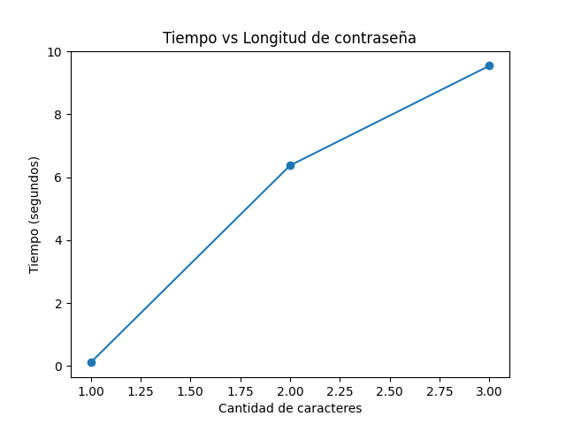

# CRUD de Usuarios + Fuerza Bruta con FastAPI

## Descripción
API REST con operaciones CRUD sobre usuarios y experimento controlado
de fuerza bruta para comprender vulnerabilidades en autenticación.
Todas las pruebas se realizaron únicamente contra entorno local de desarrollo.

## Requisitos
- Python 3.12+
- WSL Ubuntu
- VSCode

## Paso 1 - Crear entorno virtual
python3 -m venv venv

## Paso 2 - Activar entorno virtual
source venv/bin/activate

## Paso 3 - Instalar dependencias
pip install -r requirements.txt

## Paso 4 - Correr la API
fastapi dev main.py

## Paso 5 - Correr el ataque de fuerza bruta
Abrir una segunda terminal, activar el entorno virtual y ejecutar:
source venv/bin/activate
python3 bruteForce.py

## Endpoints
- POST /users — crear usuario
- GET /users — listar usuarios
- GET /users/{id} — obtener usuario
- PUT /users/{id} — actualizar usuario
- DELETE /users/{id} — eliminar usuario
- POST /login — autenticar usuario

## Resultados obtenidos
1 caracter(es)  -> 62 intentos,   0.1109 segundos
2 caracter(es)  -> 3906 intentos, 6.3746 segundos
Contraseña encontrada: 'ab1' en 4022 intentos, 9.5442 segundos

## Gráfica

## Análisis de resultados
El experimento demuestra que el tiempo necesario para romper una contraseña
crece exponencialmente con cada caracter adicional. Con 1 caracter el ataque
tardó apenas 0.11 segundos probando 62 combinaciones. Con 2 caracteres tardó
6.37 segundos probando 3906 combinaciones. Con 3 caracteres encontró la
contraseña 'ab1' en 4022 intentos y 9.54 segundos.

La gráfica muestra visualmente este crecimiento. Una contraseña de 4 caracteres
requeriría más de 14 millones de combinaciones y tardaría horas. Esto confirma
que contraseñas cortas son extremadamente vulnerables a ataques de fuerza bruta.

## Medidas de mitigación
- Usar contraseñas de mínimo 12 caracteres
- Implementar límite de intentos fallidos
- Agregar delays entre intentos de login

## Usuarios de ejemplo
| ID | Username | Password |
|----|----------|----------|
| 1  | admin    | ab1      |
| 2  | user     | user     |
| 3  | guest    | guest    |

